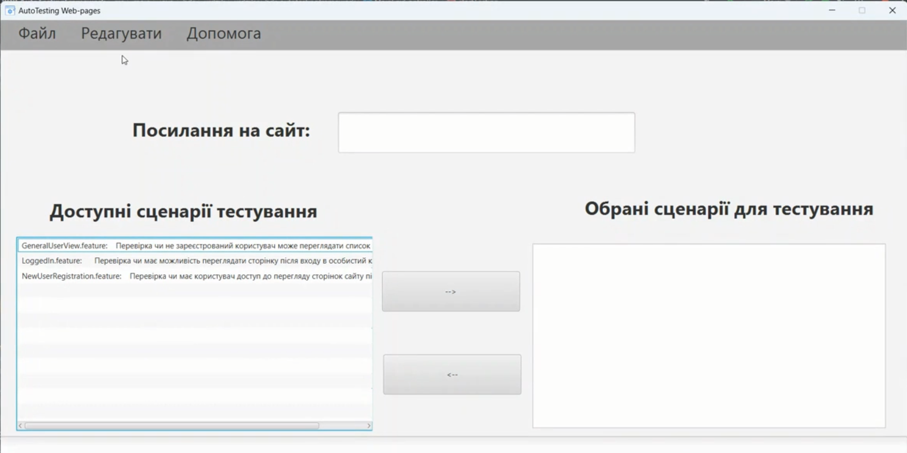
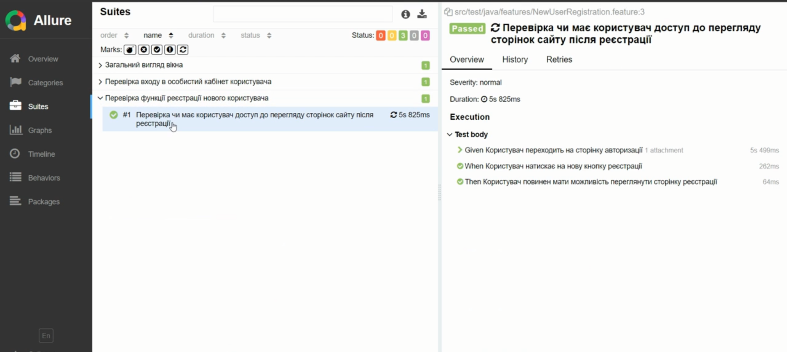

  

<h2 align="center"><b>Automated Web Application Testing Framework</b></h2>

<h4 align="center">
A modular framework for automated functional testing of web applications using modern testing technologies.
</h4>

  
  
  
  

---

## 📌 About

This project represents an **automated testing framework for web applications**, designed to improve software quality assurance by reducing manual testing effort and increasing test reliability and repeatability.

The framework enables automated execution of functional test scenarios, validation of user interface behavior, and verification of core business logic in web-based systems.  
It follows industry-standard practices in automated testing, emphasizing **scalability, maintainability, and extensibility**.

---

## ⚙️ Architecture Overview

The framework is built using a **layered architecture**, separating responsibilities between test logic, page interaction, and configuration:

- **Test Layer** – contains test cases and test suites
- **Page Object Layer** – encapsulates UI elements and user actions
- **Core Utilities** – browser management, configuration, logging
- **Data Layer** – test data and parameterization
- **Reporting Module** – test execution results and logs

---

## 🚀 Key Features

### 🧪 Automated Functional Testing
- Execution of end-to-end UI test scenarios
- Verification of page elements, navigation, and user actions
- Validation of expected system behavior

### 🧩 Page Object Model (POM)
- Clear separation between test logic and UI structure
- Improved test stability against UI changes
- Reusable page components

### ⚡ Cross-Browser Testing
- Support for popular browsers (Chrome, Firefox)
- Configurable browser selection
- Automated browser lifecycle management

### 📊 Test Reporting
- Using allure-report
- Easy analysis of test results

---

## 🛠️ Technologies Used

| Technology             | Purpose                           |
|------------------------|-----------------------------------|
| **Java**               | Core programming language         |
| **Selenium WebDriver** | Browser automation                |
| **TestNG**             | Test execution and management     |
| **Maven**              | Dependency and build management   |
| **Allure**             | Easy representing testing reports |

---

## 📸 Framework Demonstration

